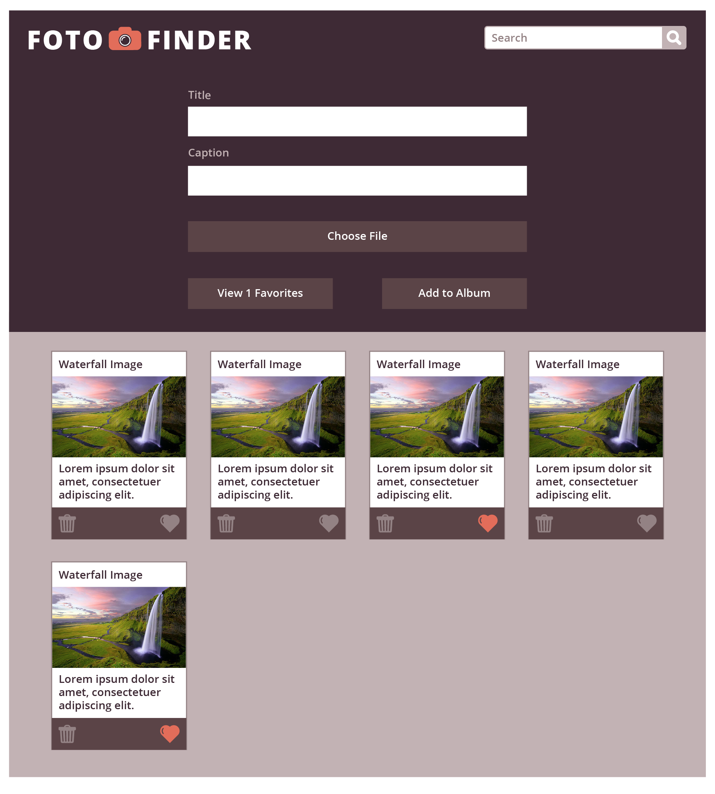
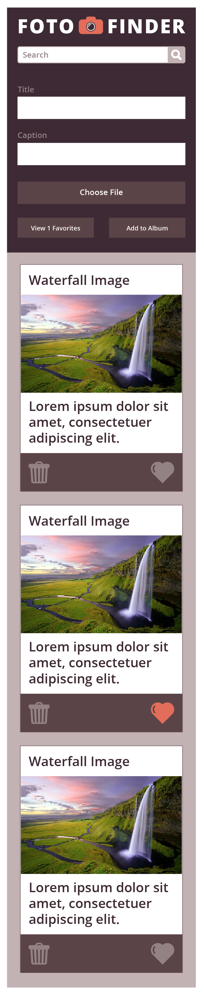

# Foto Finder Project
Name: Heather Hartley

## Link to Site
- https://hlhartley.github.io/hh-fotofinder-project/

## Overview / Overall Project Objectives
- Building a responsive photo album app/website
- Using semantic HTML tags in order to make the site organized and easily accessible for screen readers
- Writing clean and easy to read CSS
- Practicing DRY and SRP Javascript concepts
- Making use of localStorage to store data
- Employing array prototype methods such as forEach, map, filter, etc.
- Switching between 2 models: data and the DOM

## Unique Features
- Individual cards for each user submission (including: title, caption, and photo)
- Photo cards that persist in localStorage and stay on the page upon reload/refresh
- Editable input fields that save/update upon enter/click out
- Unique buttons including a "favorite button" and "show more/show less button"
- Responsiveness on desktop and mobile views
- Filtering by search

## Original Project Images
### On Desktop

### On Mobile

## My project images
### On Desktop

### On Mobile

